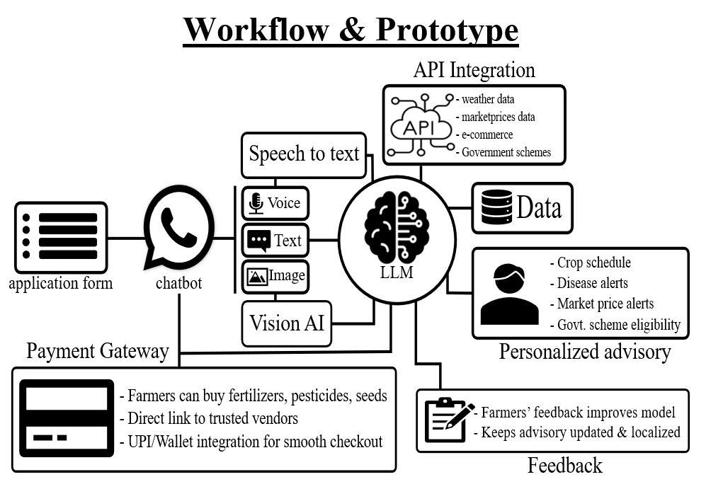

# **AgriPulse – AI-Powered Multilingual Farming Assistant (SIH 2025 Project)**

**AgriPulse** is a **WhatsApp-based multilingual AI assistant** designed for **small & marginal farmers**. It unifies **Agentic AI**, **Agri-commerce**, **AI Vision**, and **Govt-scheme awareness** into one accessible platform.

> **Note:** A **prototype demo video (Telegram version)** is included in this repository.

---

## **🌾 Project Overview**

AgriPulse bridges the gap between **advanced AI technologies** and **farmer accessibility** using familiar platforms like **WhatsApp, SMS, and USSD**. It provides **real-time crop advisory**, **AI-vision-based disease detection**, **market price comparison**, and **personalized agricultural guidance**.

This project was developed as part of **Smart India Hackathon 2025 (SIH 2025)**.

---

## **🏗️ Technical Approach**

Our comprehensive technical architecture integrates multiple AI systems, APIs, and communication channels to deliver seamless agricultural assistance:

*The diagram illustrates our end-to-end system architecture, data flow, and integration points across WhatsApp, AI models, databases, and external APIs.*

---

## **🔗 Key Features**

### **1. Unified Innovation**
* Combines **WhatsApp**, **Agentic AI workflows**, **Agri-commerce**, and **LLMs/AI Vision**
* Designed for farmers who prefer simple, familiar interfaces

### **2. Real-Time AI Advisory & Monitoring**
* Daily **crop advisory** with personalized insights
* **Pest & disease detection** using image-based AI vision
* Irrigation, fertilizer, and pesticide scheduling

### **3. Multilingual Support**
* Supports **text, voice, image messages**
* Local languages for low-literacy farmers

### **4. Price Comparison Bot**
* Fetches **seed/fertilizer/pesticide prices** across platforms
* Suggests **lowest cost options**
* Enables **1-click ordering**

### **5. Offline Capabilities**
* **SMS/USSD fallback** for low-network areas
* Proactive weather & risk alerts

### **6. Integrations**
* Weather APIs
* Market price APIs
* Government schemes APIs
* Custom-trained **ML** and **DL** models for crop/disease tasks

---

## **🚀 Why This Idea Works (Feasibility)**

* WhatsApp-first approach ensures **easy adoption**
* Works even in **low-connectivity** regions through SMS/USSD
* Solves real farmer pain points: advisory, prices, pests, schemes
* Reduces dependency on middlemen
* Boosts yield by **20–30%** based on scientific practices

---

## **💡 Benefits & Real-World Impact**

* Scientific, real-time decision-making
* Lower input cost through intelligent price comparisons
* Better market access and price discovery
* Pest/disease alerts lower crop losses
* Improved financial stability and loan repayment potential
* Accurate crop selection reduces guesswork
* Community learning through multilingual interface
* Sustainable agriculture at scale

---

## **📹 Prototype Demo**

A working **prototype demo video (Telegram version)** is also included. This showcases:

* Image-based disease detection
* Multilingual chat flow
* Real-time advisory interaction

---

## **🛠️ Tech Stack**

### **AI & ML**
* Python
* TensorFlow / PyTorch
* Scikit-Learn
* YOLO / CNN-based disease classification
* LLM-based crop & advisory reasoning

### **Backend**
* FastAPI / Flask
* REST APIs
* Webhooks for WhatsApp integration

### **Frontend / Interface**
* WhatsApp Cloud API
* Telegram Bot API (prototype)

### **Databases**
* PostgreSQL / MongoDB
* Vector DB for retrieval

--

## **📈 Future Enhancements**

* Integrate UPI-based in-chat payments
* Farmer community discussion rooms
* Real-time mandi bidding platform
* Predictive yield & soil health analytics
* Full voice-first conversational flow

---

## **📜 License**

This project is released under the **MIT License** (or specify your preferred license).

---

## **🤝 Contributions**

**Made with ❤️ by Dhruv Devaliya**

Pull requests and suggestions are always welcome!

---

## **📧 Contact**

For queries or collaboration opportunities, feel free to reach out:
* **Email:** [dhruvdevaliya@gmail.com]
* **LinkedIn:** [www.linkedin.com/in/dhruv-devaliya]

---

**#SmartIndiaHackathon2025 #AgriTech #AIforFarmers #WhatsAppBot #SustainableAgriculture**
